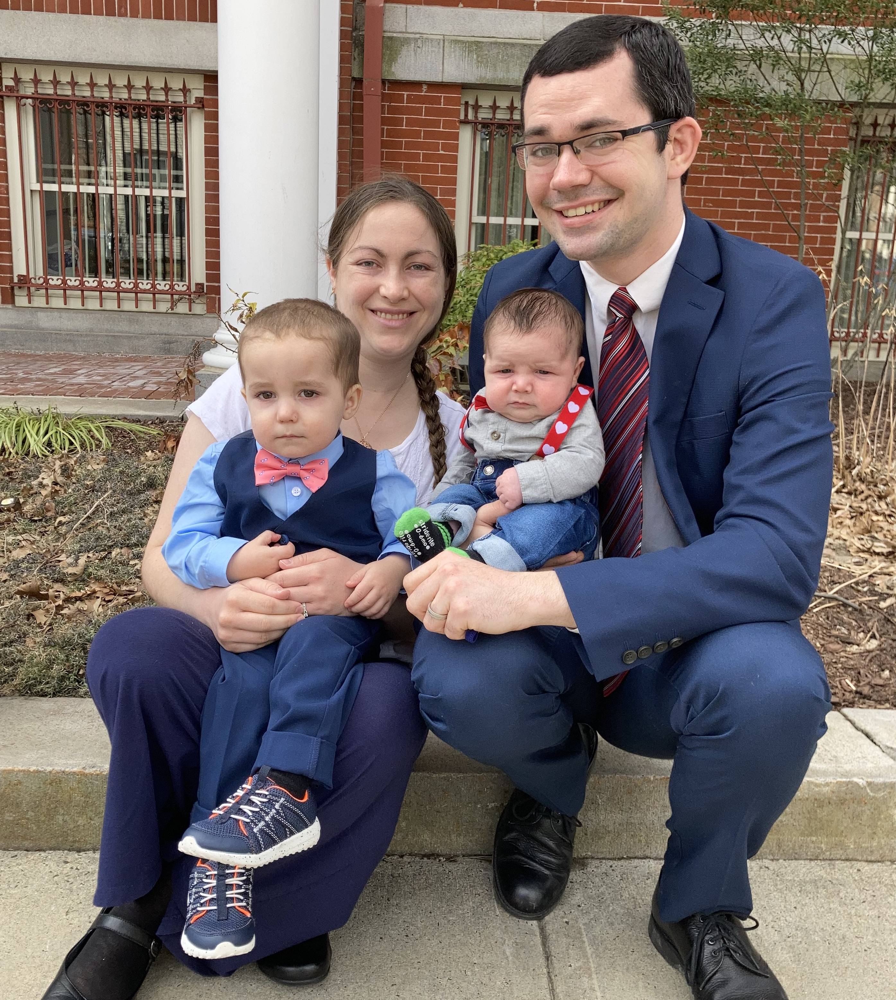

## [Research Projects](./research.html)  &nbsp; &nbsp;  CV   &nbsp; &nbsp; [Consulting](./consulting.html)

# About Me

I am currently a Ph.D. student in the Department of Statistics & Data Science at Yale University. My research interests primarily center on interpretable machine learning, unified statistical approaches that use both bayesian and frequentist techniques, and applications to the hard sciences. I have an amazing wife and two wonderful sons!

<center></center>

My hobbies include biking, piano and trombone playing, family history research, and [blogging](https://lightandtruthlds.blogspot.com).

# News

I recently gave a talk at the STAtistical Methods for the Physical Sciences (STAMPS) webinar series! [Check it out!](https://www.youtube.com/watch?v=UpooAqzIOVY&t=1s)


```
The final element.
```
