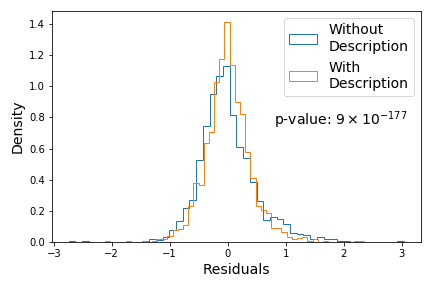
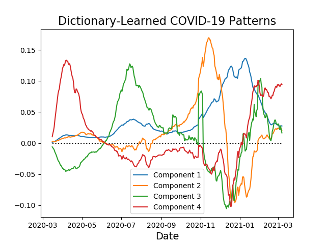

## [About Me](./)  &nbsp; &nbsp;  [CV](./parkerholzer.pdf)   &nbsp; &nbsp; [Other Sites](./consulting.html)

# Research Projects

## Astrostatistics

* **A Hermite-Gaussian Based Radial Velocity Estimation Method**: The radial velocity method is one of the techniques used to detect the signal of a planet orbiting a distant star by analyzing the light from that star. This project uses the Hermite-Gaussian functions to mathematically formulate the radial velocity method as weighted linear regression. This is shown through both simulation studies and analysis of real data to outperform the traditional cross-correlation function approach. [Paper](./20-AOAS1406.pdf) &nbsp; &nbsp; [journal link](https://projecteuclid.org/journals/annals-of-applied-statistics/volume-15/issue-2/A-HermiteGaussian-based-exoplanet-radial-velocity-estimation-method/10.1214/20-AOAS1406.full) &nbsp; &nbsp; [R package](https://CRAN.R-project.org/package=rvmethod) &nbsp; &nbsp; [Python source code](https://github.com/parkerholzer/hgrv_method) 
* **A Stellar Activity F-statistic for Exoplanet Surveys (SAFE)**: In the radial velocity method for finding exoplanets, stellar activity in the atmosphere of the host star can distort the signal imposed by the orbiting planet. This project introduces a new statistic designed to detect the presence of such stellar activity. We demonstrate that this new F-statistic behaves as expected when no stellar activity is present, and has higher statistical power than many traditional stellar activity indicators designed for the same purpose. [Paper](./Holzer_2021_AJ_161_272.pdf)  &nbsp; &nbsp; [journal link](https://iopscience.iop.org/article/10.3847/1538-3881/abf5e0) &nbsp; &nbsp; [Python source code](https://github.com/parkerholzer/safe_statistic) 

## Human Placenta

* **Trophoblasst Inclusions in the Human Placenta: Identification, Characterization, Quantification, and Interrelations of Subtypes**: Trophoblast inclusions are a feature that can occur on the human placenta during pregnancy. In this project I used statistical bootstrapping to demonstrate that the four subtypes of these inclusions have statistcally significant Spearman correlations with each other. [Paper](./1-s2.0-S0143400420304082-main.pdf) &nbsp; &nbsp; [journal link](https://www.sciencedirect.com/science/article/pii/S0143400420304082) 
* **Causes of Unexplained Pregnancy Loss**: Ongoing project
* **Genetics, Not the Uterine Environment, Drive the Formation of Trophoblast Inclusions: Insights From a Twin Study**: In this study I derived and implemented a generalized likelihood ratio test for testing whether two samples of exponentially-distributed random variables have the same mean. Applying this to a study of monozygotic and dizygotic twins, we find that the trophoblast inclusion difference is greater for dizygotic twins than for monozygotic twins. [Paper](./1-s2.0-S0143400421001284-main.pdf) &nbsp; &nbsp; [journal link](https://www.sciencedirect.com/science/article/pii/S0143400421001284?via%3Dihub) (see Supplementary File in Appendix A)

## Other Projects

* **Topic-Modeling of Connecticut House Descriptions**: Ever wondered whether it's worth reading over those lengthy descriptions on real estate websites when searching for a house to buy? Well, using topic-modeling on the house descriptions for a set of Connecticut houses listed for sale in early 2021 and plugging in the results to a linear model of the listing price with the living area, lot size, bedroom count, bathroom count, and year built, I find that the answer is ABSOLUTELY! With statistical significance (p-value < 0.00000001) including the (dimensionally-reduced) house descriptions is found to improve the prediction of the listing price by approximately 35%! So if you're buying a house, don't skip over the house descriptions. [Python source code](https://github.com/parkerholzer/ConnecticutHouses) 
* **COVID-19 Dictionary Learning**: In this project I analyze the time series of positive cases for COVID-19 for each of the United States and territories using dictionary learning. Overall, approximately 95% of the data can be explained as a linear combination of four interpretable patterns, suggesting that the pandemic's progression over time in the United States is actually rather straight-forward. [Python source code](https://github.com/parkerholzer/COVID19_dictionary_learning) 
* **Bountiful Real Estate Home Value Modeling**: Here I use webscraping to obtain data on recently (as of March 2021) sold houses in Bountiful, Utah. Using multiple regression I demonstrate that after acconting for effects of lot size, year built, living area, and bathroom count, the value *decreases* by about $15,000 for each additional bedroom. Furthermore, I demonstrate that the value depends more quadratically than linearly on the living area. [R source code](https://github.com/parkerholzer/Bountiful_houses_sold) 
